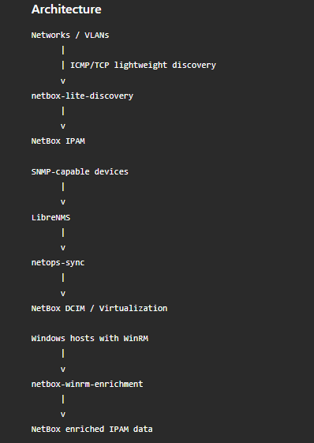
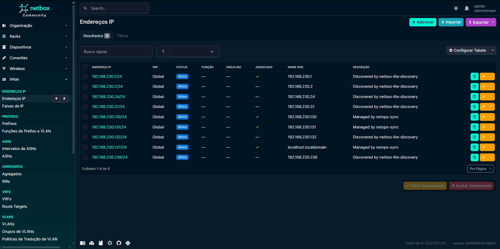

# NetBox NetOps Discovery Lab

Pipeline de descoberta leve, controle de IPAM e enriquecimento progressivo de ativos usando **NetBox**, **LibreNMS**, **K3s** e **Python**.

> Projeto de laboratório voltado para NetOps/SecOps, criado para estudar visibilidade de ativos, descoberta controlada por VLAN, integração SNMP e enriquecimento via WinRM.

---

## Visão geral

Em muitos ambientes de infraestrutura e segurança, uma pergunta simples pode ser difícil de responder com precisão:

> Quais IPs estão realmente em uso nas minhas redes?

Este projeto propõe uma arquitetura incremental para responder essa pergunta sem depender de um único método de descoberta e sem realizar varreduras agressivas.

A solução usa:

- **NetBox** como IPAM e inventário central;
- **LibreNMS** para descoberta e monitoramento SNMP;
- **Python** para discovery leve via ICMP/TCP;
- **WinRM** para enriquecimento de hosts Windows elegíveis;
- **K3s** para orquestrar os workers como CronJobs;
- Separação entre **IPAM**, **Virtual Machines** e **DCIM Devices** dentro do NetBox.

---

## Arquitetura

> Substituir a imagem abaixo por um diagrama próprio do projeto.



```text
VLANs / Redes conhecidas
        |
        | Discovery leve ICMP/TCP
        v
netbox-lite-discovery
        |
        | Atualiza IPAM, TTL, portas e provável SO
        v
NetBox IPAM

Dispositivos com SNMP
        |
        | SNMP
        v
LibreNMS
        |
        | API
        v
netops-sync
        |
        | Atualiza NetBox
        v
NetBox Virtualization / DCIM

Hosts Windows com WinRM
        |
        | WinRM 5985/5986
        v
netbox-winrm-enrichment
        |
        | Enriquece OS, versão, hostname, domínio/workgroup, boot e serviços
        v
NetBox IPAM
```

---

## Objetivos do projeto

- Descobrir IPs ativos em redes/VLANs autorizadas;
- Classificar minimamente ativos como Windows, Linux/Unix, Network/Appliance ou Unknown;
- Atualizar o IPAM automaticamente no NetBox;
- Usar LibreNMS para descoberta e monitoramento de ativos com SNMP;
- Enriquecer hosts Windows via WinRM quando disponível;
- Separar máquinas virtuais de dispositivos de rede;
- Criar uma base futura para topologia usando ARP, FDB, LLDP/CDP e dados de switches/firewalls;
- Manter a descoberta controlada, com baixa agressividade e escopo definido.

---

## Stack utilizada

| Componente | Função |
|---|---|
| Rocky Linux | Host base do laboratório |
| K3s | Kubernetes leve |
| Helm | Instalação do NetBox |
| NetBox | IPAM e inventário central |
| LibreNMS | Monitoramento e descoberta SNMP |
| MariaDB | Banco do LibreNMS |
| Redis | Dispatcher/cache do LibreNMS |
| Python | Scripts de discovery, sync e enrichment |
| WinRM | Enriquecimento de hosts Windows |
| SNMP | Coleta em switches, firewalls, roteadores e appliances |

---

## Modelo de dados no NetBox

O projeto separa os ativos em três camadas principais:

| Tipo de informação | Local no NetBox |
|---|---|
| IP ativo, mesmo sem identificação completa | IPAM > IP Addresses |
| Máquinas virtuais Windows/Linux | Virtualization > Virtual Machines |
| Switches, firewalls, roteadores e appliances | DCIM > Devices |

Essa separação evita que VMs sejam cadastradas como equipamentos físicos e mantém o inventário mais fiel ao ambiente real.

---

## Fluxos implementados

### 1. Discovery leve sem SNMP

O `netbox-lite-discovery` identifica IPs ativos usando um perfil seguro:

- ICMP ping;
- Coleta de TTL;
- Teste TCP em poucas portas;
- Classificação básica de sistema operacional;
- Atualização de custom fields no NetBox.

Portas do perfil seguro:

```text
22    SSH
80    HTTP
443   HTTPS
135   Windows RPC
139   NetBIOS
445   SMB
3389  RDP
5985  WinRM HTTP
5986  WinRM HTTPS
```

Exemplo de resultado:

```text
192.168.100.10 -> Linux/Unix, TTL 64, portas 22/80/443
192.168.100.20 -> Windows, TTL 128, portas 135/139/445/5985
192.168.100.30 -> Unknown, ativo sem portas no perfil seguro
```

---

### 2. Integração SNMP com LibreNMS

O LibreNMS é usado para ativos que suportam SNMP, como:

- Switches;
- Firewalls;
- Roteadores;
- Appliances;
- Servidores com SNMP habilitado.

O `netops-sync` consulta a API do LibreNMS e atualiza o NetBox.

A classificação segue a lógica:

```text
Windows/Linux/VMware/Generic x86 -> Virtualization > Virtual Machines
Firewall/Switch/Router/Appliance -> DCIM > Devices
Nome inválido/IP-only             -> IPAM only
```

---

### 3. Enriquecimento via WinRM

O `netbox-winrm-enrichment` consulta o NetBox, busca IPs com WinRM elegível e coleta dados reais do Windows:

- ComputerName;
- Sistema operacional;
- Versão;
- Build;
- Último boot;
- Domínio ou workgroup;
- Fabricante;
- Modelo;
- Serial;
- Serviços relevantes.

Exemplo de saída coletada:

```json
{
  "ComputerName": "WIN-SERVER-LAB",
  "Caption": "Microsoft Windows Server 2012 R2 Standard",
  "Version": "6.3.9600",
  "BuildNumber": "9600",
  "LastBootUpTime": "2026-05-31T16:36:07",
  "Domain": "WORKGROUP",
  "Manufacturer": "VMware, Inc.",
  "Model": "VMware Virtual Platform"
}
```

---

## Custom Fields utilizados no NetBox

Os scripts atualizam campos personalizados para rastrear descoberta e enriquecimento.

| Campo | Uso |
|---|---|
| `first_seen` | Primeira vez em que o ativo foi visto |
| `last_seen` | Última vez em que o ativo foi visto |
| `discovery_source` | Fonte da descoberta |
| `probable_os` | Sistema operacional provável |
| `confidence` | Confiança da classificação |
| `ttl` | TTL observado |
| `open_ports` | Portas abertas detectadas |
| `scan_profile` | Perfil de scan utilizado |
| `winrm_eligible` | Indica elegibilidade para WinRM |
| `ssh_eligible` | Indica elegibilidade para SSH |
| `enrichment_status` | Resultado do enriquecimento |
| `enrichment_source` | Fonte do enriquecimento |
| `enrichment_last_run` | Última execução de enriquecimento |
| `enrichment_error` | Último erro de enriquecimento |
| `os_name` | Nome do sistema operacional |
| `os_version` | Versão do sistema operacional |
| `domain_or_workgroup` | Domínio ou workgroup |
| `last_boot` | Último boot |
| `detected_services` | Serviços relevantes detectados |

---

## Estrutura sugerida do repositório

```text
netbox-netops-discovery/
├── README.md
├── LICENSE
├── .gitignore
├── docs/
│   ├── architecture.md
│   ├── lab-installation.md
│   ├── discovery-strategy.md
│   ├── snmp-strategy.md
│   ├── winrm-enrichment.md
│   └── security-considerations.md
├── images/
│   ├── architecture.png
│   ├── netbox-ipam.png
│   ├── netbox-vms.png
│   ├── librenms-devices.png
│   └── jobs-logs.png
├── k8s/
│   ├── netbox/
│   ├── librenms/
│   ├── netops-discovery/
│   └── netops-sync/
├── scripts/
│   ├── netbox-lite-discovery/
│   ├── netbox-winrm-enrichment/
│   ├── netops-sync/
│   └── netbox-bootstrap/
└── examples/
    ├── ranges.csv
    ├── sample-output.md
    └── custom-fields.json
```

---

## Exemplos de imagens para adicionar depois

Adicionar prints ou diagramas nestes pontos:

### NetBox IPAM



### Virtual Machines no NetBox


### LibreNMS Devices


### Logs dos CronJobs


---

## Instalação resumida

### 1. Subir K3s

```bash
curl -sfL https://get.k3s.io | sh -s - --write-kubeconfig-mode 644
```

### 2. Instalar Helm

```bash
curl https://raw.githubusercontent.com/helm/helm/main/scripts/get-helm-3 | bash
```

### 3. Instalar NetBox

```bash
helm repo add netbox https://charts.netbox.oss.netboxlabs.com/
helm repo update

kubectl create namespace netbox

helm install netbox netbox/netbox \
  -n netbox \
  -f k8s/netbox/netbox-values.example.yaml
```

### 4. Subir LibreNMS

```bash
kubectl create namespace librenms

kubectl apply -f k8s/librenms/
```

### 5. Subir workers de discovery

```bash
kubectl create namespace netops-discovery

kubectl apply -f k8s/netops-discovery/
```

### 6. Subir sync LibreNMS -> NetBox

```bash
kubectl create namespace netops-sync

kubectl apply -f k8s/netops-sync/
```

---

## Exemplo de ranges autorizados

```csv
prefix,site,enabled,scan_profile
192.168.100.0/24,Lab,true,safe
10.10.10.0/24,Datacenter,false,safe
10.20.30.0/24,Cloud,false,safe
```

---

## Frequência recomendada

### Laboratório

```text
netbox-lite-discovery: */30 * * * *
netops-sync:           */5 * * * *
librenms-snmp-scan:    */30 * * * *
```

### Ambiente corporativo

```text
netbox-lite-discovery: 0 2 * * *
netops-sync:           */15 * * * *
librenms-snmp-scan:    0 3 * * *
winrm-enrichment:      sob demanda ou janela controlada
```

---

## Segurança e boas práticas

Este projeto foi pensado para descoberta controlada.

Evitar:

- Scan em ranges muito grandes sem aprovação;
- Scan em horário comercial;
- Uso de `nmap -A`, `-O`, `-sV` amplo ou scripts NSE por padrão;
- Scan em redes de fornecedores, clientes ou ambientes críticos sem autorização;
- Senhas e tokens em arquivos versionados;
- WinRM Basic/HTTP em produção.

Preferir:

- Ranges pequenos;
- VLAN por VLAN;
- Janelas controladas;
- SNMPv3 em produção;
- WinRM com Kerberos/domínio ou HTTPS;
- Secrets protegidos;
- Logs auditáveis;
- Revisão antes de habilitar novas redes.

---

## Roadmap

- [ ] Criar imagens próprias para os workers Python;
- [ ] Adicionar coleta por DNS;
- [ ] Adicionar coleta por DHCP;
- [ ] Adicionar integração com Active Directory;
- [ ] Adicionar integração com APIs de cloud;
- [ ] Coletar ARP/FDB/LLDP de switches e firewalls;
- [ ] Mapear IP -> MAC -> switch -> porta -> VLAN;
- [ ] Gerar topologia visual;
- [ ] Criar dashboards;
- [ ] Adicionar CI/CD para validar manifests;
- [ ] Migrar WinRM para HTTPS/Kerberos em cenário corporativo;
- [ ] Melhorar classificação de Network/Appliance.

---

## Exemplo de resultado esperado

```text
IP: 192.168.100.10
Status: Active
Probable OS: Linux/Unix
TTL: 64
Open ports: 22,80,443
SSH eligible: true
Last seen: updated automatically

IP: 192.168.100.20
Status: Active
Probable OS: Windows
TTL: 128
Open ports: 135,139,445,5985
WinRM eligible: true
OS Name: Microsoft Windows Server
Enrichment status: success

IP: 192.168.100.30
Status: Active
Probable OS: Unknown
TTL: 255
Open ports: 80,443
Classification: pending review
```

---

## Possíveis casos de uso

- Inventário inicial de VLANs;
- Apoio a Segurança da Informação;
- Baseline para gestão de vulnerabilidades;
- Identificação de IPs ativos sem cadastro;
- Apoio a troubleshooting;
- Enriquecimento gradual de ativos;
- Separação entre VMs e dispositivos de rede;
- Base para topologia futura;
- Apoio a auditorias e GMUDs.

---

## Disclaimer

Este projeto é destinado a laboratório, estudo, portfólio e ambientes controlados.

Não execute descoberta de rede em ambientes que você não administra ou não tem autorização formal para avaliar.

---

## Autor

Criado como laboratório de estudo em NetOps/SecOps, automação de infraestrutura e visibilidade de ativos.

